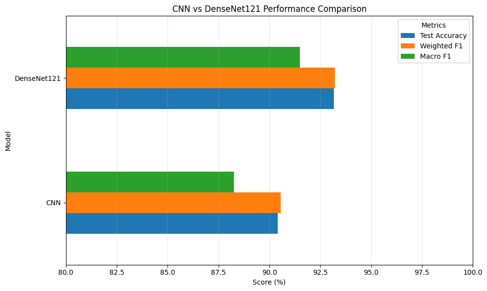
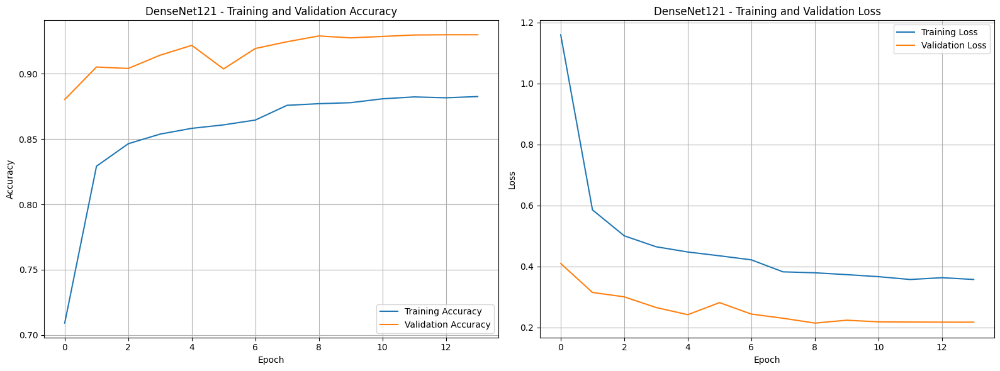
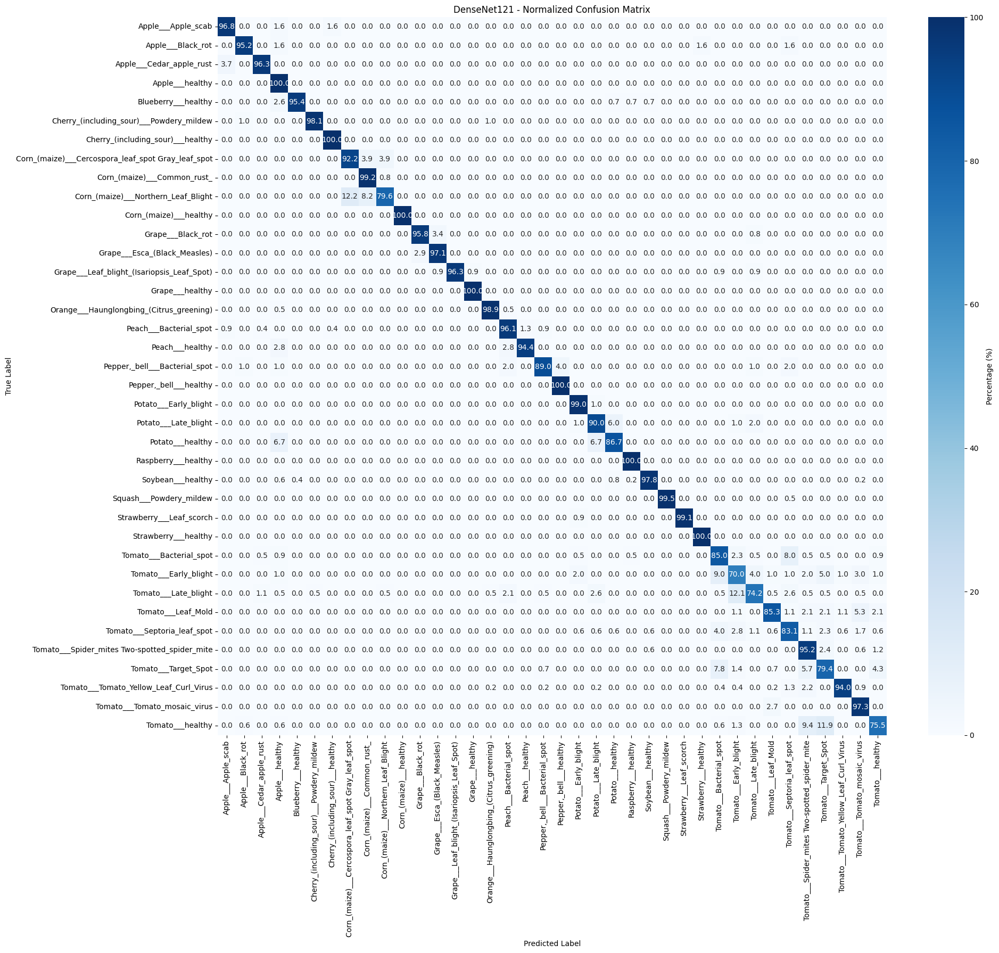
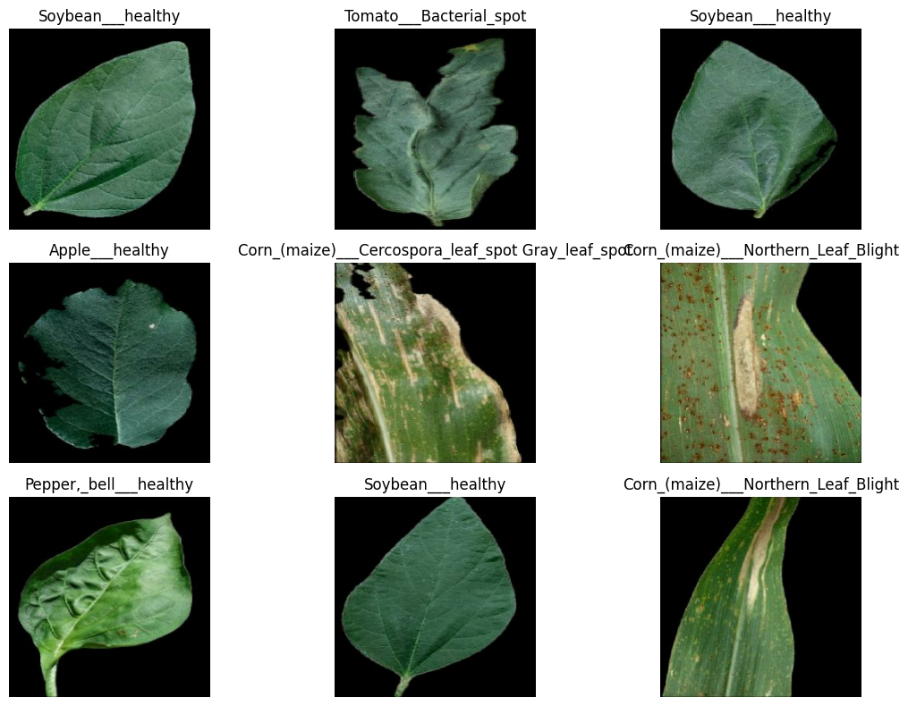

# 🌱 Plant Disease Detection using Deep Learning

An end-to-end Deep Learning and Computer Vision project for identifying plant diseases across 38 distinct crop categories using the **PlantVillage** dataset. This repository benchmarks a **Custom Convolutional Neural Network (CNN)** against **Transfer Learning with DenseNet-121**, demonstrating state-of-the-art diagnostic performance.

---

### 🚀 Interactive Notebooks

| Notebook | Open in Colab | Fast Web Viewer |
| :--- | :---: | :---: |
| **CNN & DenseNet-121 Benchmark** | [](https://colab.research.google.com/github/anuj-iitkgp/Plant-Disease-Detection/blob/main/Disease_Prediction_CNN_and_DenseNet121_by_Anuj.ipynb) | [](https://nbviewer.org/github/anuj-iitkgp/Plant-Disease-Detection/blob/main/Disease_Prediction_CNN_and_DenseNet121_by_Anuj.ipynb) |
| **DenseNet-121 Pretrained Pipeline** | [](https://colab.research.google.com/github/anuj-iitkgp/Plant-Disease-Detection/blob/main/Disease_Prediction_Pretrained_by_Anuj_final.ipynb) | [](https://nbviewer.org/github/anuj-iitkgp/Plant-Disease-Detection/blob/main/Disease_Prediction_Pretrained_by_Anuj_final.ipynb) |

---

## 📌 Table of Contents
- [Overview](#-overview)
- [Key Results](#-key-results)
- [Visualizations & Performance](#-visualizations--performance)
- [Repository Structure](#-repository-structure)
- [Dataset](#-dataset)
- [Model Architecture & Methodology](#-model-architecture--methodology)
- [Getting Started](#-getting-started)
- [Tech Stack](#-tech-stack)
- [Author](#-author)

---

## 🔬 Overview

Plant diseases cause severe yield losses in agriculture worldwide. Early and automated diagnosis is crucial for targeted treatment and crop protection.

This project delivers:
- Automated dataset acquisition and inspection pipeline using `kagglehub`.
- Rigorous data cleaning (corrupted image detection, duplicate image removal, class imbalance analysis).
- Data augmentation and stratified Train / Validation / Test dataset partitioning.
- Training and benchmarking of:
  1. A **Custom Deep CNN** architecture built from scratch.
  2. A **Pretrained DenseNet-121** model leveraging transfer learning and feature extraction.
- In-depth evaluation: Confusion Matrices, per-class Classification Reports, Macro & Weighted F1-scores.

---

## 📊 Key Results

Both models were evaluated on an unseen stratified test set:

| Model | Test Accuracy | Weighted F1 Score | Macro F1 Score | Test Loss |
| :--- | :---: | :---: | :---: | :---: |
| **Custom CNN** | 90.38% | 90.53% | 88.27% | 0.3541 |
| **DenseNet-121 (Pretrained)** | **93.17%** | **93.22%** | **91.51%** | **0.2128** |

> **Takeaway:** DenseNet-121 outperforms the custom CNN by ~2.8% in overall accuracy and achieves higher recall across rare and subtle disease categories thanks to deep feature representations learned on ImageNet.

---

## 📈 Visualizations & Performance

### 1. Model Comparison


### 2. DenseNet-121 Training Dynamics


### 3. DenseNet-121 Confusion Matrix


### 4. Sample Leaves from the Dataset


---

## 📂 Repository Structure

```plaintext
├── assets/                                                # Visualization charts and performance plots
│   ├── cnn_vs_densenet121_comparison.png
│   ├── densenet121_training_performance.png
│   ├── densenet121_confusion_matrix.png
│   └── sample_dataset_images.png
├── Disease_Prediction_CNN_and_DenseNet121_by_Anuj.ipynb   # Complete pipeline comparing Custom CNN & DenseNet-121
├── Disease_Prediction_Pretrained_by_Anuj_final.ipynb      # Finalized transfer learning notebook with inference pipeline
├── .gitignore                                             # Excludes datasets, model weights, and cache
└── README.md                                              # Project documentation
```

---

## 📦 Dataset

The project uses the **PlantVillage** dataset containing leaf images across healthy and diseased crop varieties:
- **Classes:** 38 distinct plant-disease categories (e.g., Apple Scab, Corn Common Rust, Potato Early Blight, Tomato Yellow Leaf Curl Virus, etc.).
- **Automatic Download:** Handled programmatically in the notebooks via:
  ```python
  import kagglehub
  IMAGE_DIR = kagglehub.dataset_download("abdallahalidev/plantvillage-dataset")
  ```

---

## 🛠 Model Architecture & Methodology

### 1. Data Preprocessing & Augmentation
- Duplicate image detection and removal via hashing.
- Integrity verification to discard unreadable/corrupted files.
- Resizing to standardized resolution (`224x224` for DenseNet-121, `128x128` / `224x224` for CNN).
- Data augmentation: Random horizontal flips, rotations, zoom, and contrast adjustments to reduce overfitting.
- Stratified Train / Validation / Test split preserving class distributions.
- TensorFlow `tf.data` pipeline optimization with `prefetch` and `AUTOTUNE`.

### 2. Custom CNN
- Sequential convolutional blocks with `Conv2D`, `BatchNormalization`, `ReLU` activations, and `MaxPooling2D`.
- Global Average Pooling / Dense layers with `Dropout` regularizers.
- Softmax output layer with 38 class logits.

### 3. Transfer Learning: DenseNet-121
- Base model instantiated with ImageNet pre-trained weights (`include_top=False`).
- Base layers frozen to retain generalized low- and mid-level feature representations.
- Custom classification head: `GlobalAveragePooling2D`, `Dense` layers with `BatchNormalization`, `Dropout`, and multi-class `Softmax`.

---

## 🚀 Getting Started

### Prerequisites
- Python 3.9+
- GPU runtime recommended (e.g., CUDA-enabled local machine, Google Colab, or Kaggle Notebooks).

### Installation
Clone the repository:
```bash
git clone https://github.com/anuj-iitkgp/Plant-Disease-Detection.git
cd Plant-Disease-Detection
```

Create and activate a virtual environment:
```bash
python3 -m venv venv
source venv/bin/activate  # On Windows: venv\Scripts\activate
```

Install dependencies:
```bash
pip install tensorflow keras torch torchvision pandas numpy matplotlib seaborn scikit-learn kagglehub
```

### Running the Notebooks
Launch Jupyter Lab or Notebook:
```bash
jupyter notebook
```
- Open `Disease_Prediction_CNN_and_DenseNet121_by_Anuj.ipynb` to inspect training, evaluation, and comparisons.
- Open `Disease_Prediction_Pretrained_by_Anuj_final.ipynb` to inspect the dedicated transfer learning inference pipeline.

---

## 💻 Tech Stack

- **Deep Learning & ML:** TensorFlow, Keras, Scikit-Learn
- **Data Manipulation:** NumPy, Pandas
- **Visualization:** Matplotlib, Seaborn
- **Environment:** Jupyter Notebook, KaggleHub

---

## 👤 Author

**Anuj Yadav**  
- GitHub: [@anuj-iitkgp](https://github.com/anuj-iitkgp)
